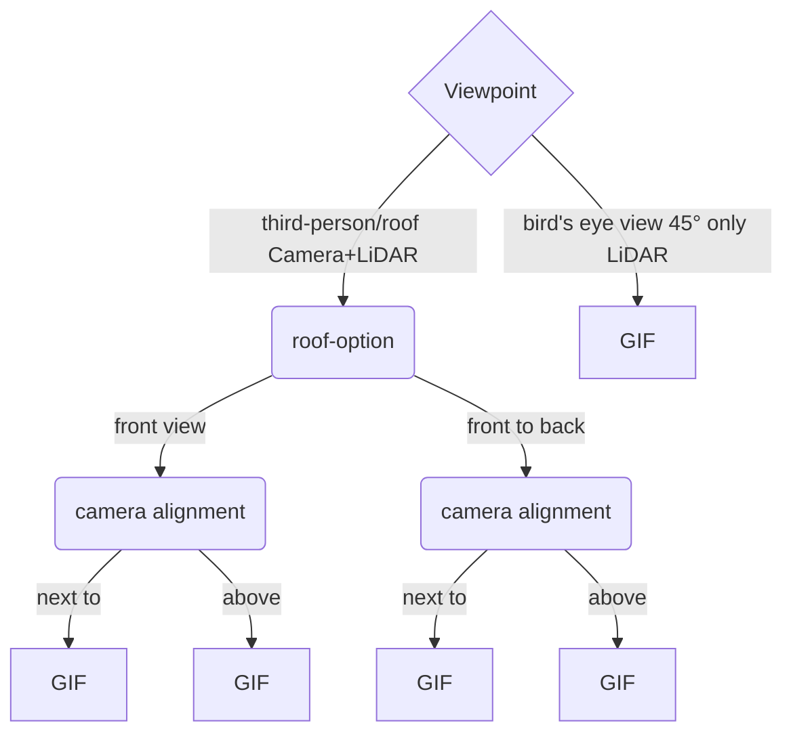

# Scope Dataset Toolkit (available soon)


Here you can download the official Toolkit for the [SCOPE dataset](https://ekut-es.github.io/scope/).
The Toolkit provides functionality for an efficient parallel download, visualization and evaluation of Collective Perception Algorithms.


## Installation

Use the package manager [pip](https://pip.pypa.io/en/stable/) to install the Toolkit.

```bash
pip install scope-toolkit
```

## Usage
Once installed, you can start using the Toolkit to enhance your workflow with the SCOPE dataset. 

### Download

The Toolkit allows efficient parallel downloading and extraction into the correct structure of the SCOPE dataset.

Simply run 
```
cd ~/dataset-toolkit
python dataset-toolkit/TODO_ADD_PATH_TO/download_dataset.py
```
and follow the on-screen instructions.


### Visualization


The visualization module allows for an easy exploration of the dataset.

To visualize a scenario run
```
cd ~/dataset-toolkit
python dataset-toolkit/TODO_ADD_PATH_TO/visualize_sequence.py
```
and follow the on-screen instructions.
This will create a GIF of the selected scenario while following the selected car in the given scenario.

Currently there are a few different perspectives implemented. Those are



### Evaluation (TODO)
Evaluation module for easy and fair comparison of different methods using state-of-the-art metrics
TODO

## Roadmap

## Contributing

## Authors and acknowledgment

## License

## Project status

## Citation